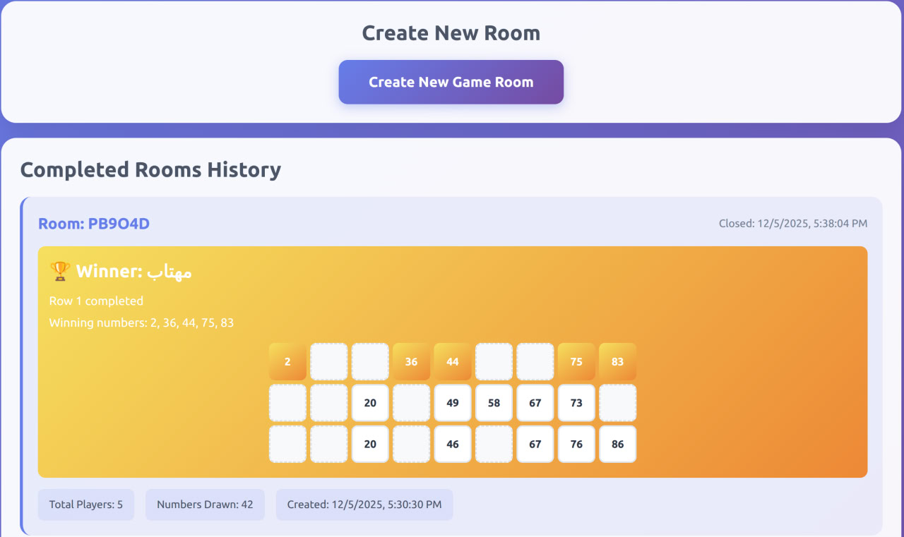
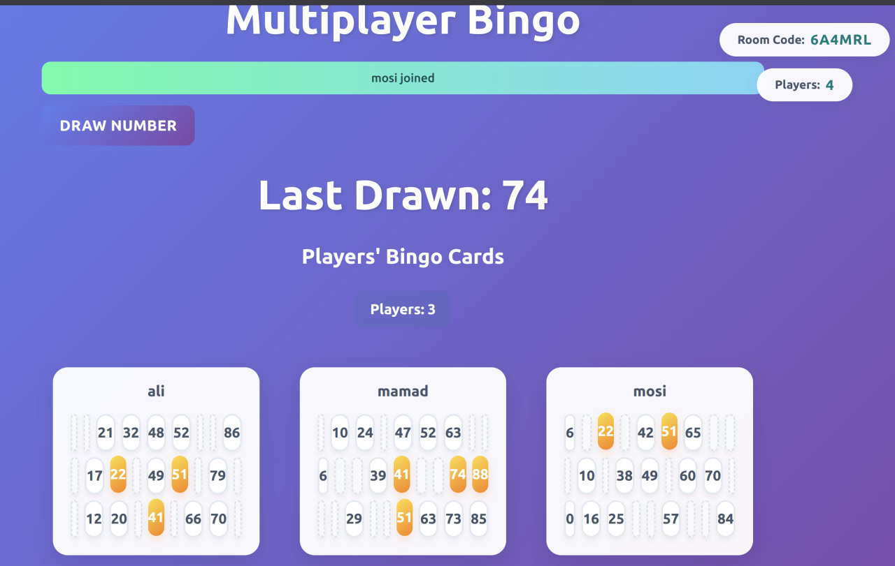

# 🎮 Multiplayer Bingo - Server-based Real-time Game


A modern, real-time multiplayer Bingo game with server-based architecture. Features admin authentication and room management with Docker support for easy deployment.

## ✨ Features

- **🔥 Real-time Communication**: Using Socket.io for synchronized gameplay
- **🎯 Real-time Number Drawing**: Synchronized number drawing with animations across all players
- **👑 Admin System**: Only admins can create rooms
- **🎨 Modern UI/UX**: Beautiful, responsive design with smooth animations
- **🐳 Docker Support**: Easy deployment with Docker and Docker Compose
- **📱 Mobile Responsive**: Play on any device, any screen size
- **🚀 Easy to Join**: Simple 6-character room codes for quick game access
- **🌐 Domain Ready**: Can be accessed from any domain
- **📜 Histroy of Rooms**: Save Room details, creation date, winner name, number of players and etc. 

## 🎯 How It Works

1. **Admin Login**:
   - Admins must login to create rooms
   - Default credentials: `admin` / `admin123` (change in `.env`)

2. **Room Creation** (Admin Only):
   - Admin creates a room and gets a unique 6-character code
   - Room code can be shared with other players

3. **Joining a Game**:
   - Players enter the 6-character room code
   - Connection established through the server

4. **Gameplay**:
   - Admin draws numbers
   - All players see synchronized number drawing animations
   - Numbers are marked automatically on players' cards
   - Track drawn numbers in real-time

## 🚀 Technology Stack

- **Backend**: Node.js, Express
- **Real-time Communication**: Socket.io
- **Frontend**: HTML5, CSS3, JavaScript
- **UI Framework**: Bootstrap 5
- **Containerization**: Docker, Docker Compose
- **Authentication**: JWT (JSON Web Tokens)

## 🛠️ Setup and Installation

### Environment Variables

Create a `.env` file or set these environment variables:

- `PORT`: Server port (default: 3000)
- `ADMIN_USERNAME`: Admin username (default: admin)
- `ADMIN_PASSWORD`: Admin password (default: admin123)
- `JWT_SECRET`: Secret key for JWT tokens (change in production!)

### Using Docker (Recommended)

1. **Clone the repository**:
```bash
git clone https://github.com/alidoosti01/ServerBase-Real-Time-Multiplayer-Bingo.git
cd ServerBase-Real-Time-Multiplayer-Bingo
```

2. **Configure environment variables** (optional):
```bash
nano .env
# Edit .env file with your preferred settings
```

3. **Build and run with Docker Compose**:
```bash
docker-compose up -d
```

4. **Access the application**:
   - Open your browser and navigate to `http://localhost:3000`
   - Or use your domain if configured

## 🐳 Docker Configuration

### Docker Commands

```bash
# Build and start
docker-compose up -d

# View logs
docker-compose logs -f

# Stop
docker-compose down

# Rebuild
docker-compose up -d --build
```

## 🌐 Domain Configuration

To make the application accessible from a domain:

1. **Set up reverse proxy** (Nginx recommended):
```nginx
server {
    listen 80;
    server_name yourdomain.com;

    location / {
        proxy_pass http://localhost:3000;
        proxy_http_version 1.1;
        proxy_set_header Upgrade $http_upgrade;
        proxy_set_header Connection 'upgrade';
        proxy_set_header Host $host;
        proxy_cache_bypass $http_upgrade;
    }
}
```

2. **Update Docker Compose** (if needed):
   - Expose port 3000 or configure your reverse proxy

## 📸 Screenshots


*Room creation and see History of games*


*Active gameplay with drawn numbers and see players card - admin only*


*Bingo on 3 players*

## 🤝 Contributing

Contributions are welcome! Here's how you can help:

1. Fork the repository
2. Create a feature branch (`git checkout -b feature/AmazingFeature`)
3. Commit your changes (`git commit -m 'Add some AmazingFeature'`)
4. Push to the branch (`git push origin feature/AmazingFeature`)
5. Open a Pull Request

## 📝 License

This project is licensed under the MIT License - see the [LICENSE](LICENSE) file for details.

## 🌟 Show Your Support

If you find this project interesting or useful, please consider giving it a star ⭐️ on GitHub!

## 📧 Contact

Bilge Ozan Per - [@LinkedIn](https://www.linkedin.com/in/ozanper/)
Ali Doosti - [@LinkedIn](https://www.linkedin.com/in/alidoosti01/)

---

Made with ❤️ and JavaScript and DevOps
